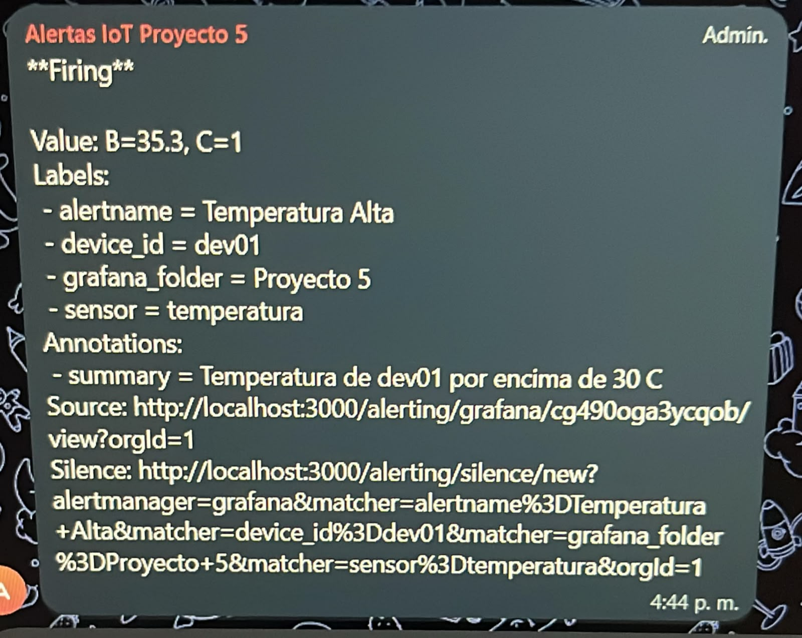
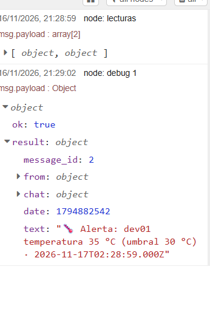
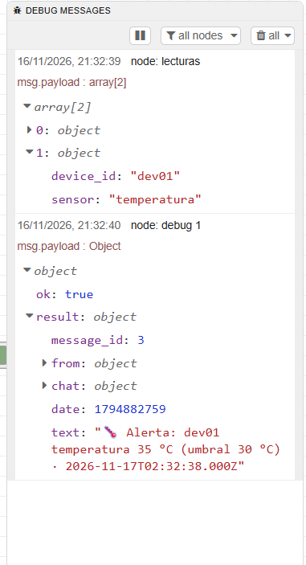
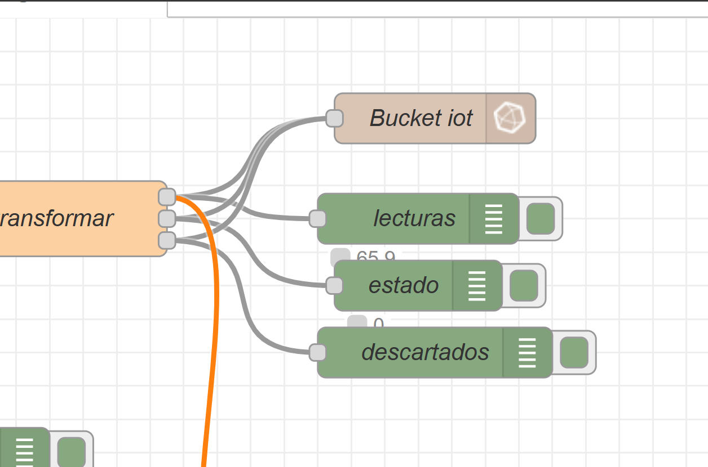

# Evidencia R5.6 — Alertas por umbral

| Campo | Valor |
|---|---|
| Criterio de aceptación | Alerta disparada y recibida en menos de 30 segundos tras superar el umbral; demostrado en vivo. |
| Responsable | Rol 4 · Rol 3 |
| Estado | 🟨 En progreso |
| Pruebas definidas en | [requerimientos.md](../requerimientos.md) |
| Plantilla | [PLANTILLA.md](PLANTILLA.md) |
| Capturas | `docs/evidencias/img/R5.6/` |

## Resumen

| ID | Prueba | Veredicto | Fecha | Revisado por |
|---|---|---|---|---|
| P6.1 | Test del contact point de Telegram | ⬜ | | |
| P6.2 | 5 mediciones por debajo de 30 s | 🟨 (Grafana: 2 de 5 · Node-RED: montado en Azure, mediciones pendientes) | 2026-11-16 | Alejandro Domínguez Torres |
| P6.3 | Umbral configurable sin tocar código | 🟨 | 2026-11-06 | Alejandro Domínguez Torres |
| P6.4 | Sin alertas falsas en 10 minutos | 🟨 (falta captura del chat de alertas) | 2026-11-16 | |

Leyenda: ⬜ Pendiente · ✅ Pasa · ❌ Falla · 🟨 Parcial

---

## P6.1
<!-- Pegar aquí el bloque de la plantilla llenado -->

## P6.2

### P6.2 — Alerta de temperatura en menos de 30 s · Intento 1 (2 mediciones de 5)

| Campo | Valor |
|---|---|
| Requerimiento | R5.6 |
| Ejecutada por | Kevin Aristizabal (Rol 1), con otro integrante del grupo leyendo Telegram |
| Fecha y hora | 2026-11-16 16:44 y 16:48 (Bogotá) |
| Entorno | VM Azure `vm-iot-backend` · Grafana 11.3.0 con las reglas corregidas (PR #17) y el dashboard versión 15 · simulador `v3` · `dev01` y `dev02` en VirtualBox · registro de `mosquitto_sub` abierto durante toda la prueba |
| Precondiciones | Reglas con evaluación cada 10 s y notificación sin espera (PR #17); `dev01` publicando 20–29 °C |

**Qué se probó:** Que cuando la temperatura supera 30 °C llegue la alerta a Telegram en menos de 30 s.

**Cómo (pasos):**

1. En Balena, `dev01` → Device Variables → `TEMP_FORZADA` = `35` (después `32`). El contenedor se reinicia y publica esa temperatura ±0.5.
2. Se esperó la alerta en Telegram **sin tocar nada más**.
3. Para resolver se **bajó** el valor de la variable a un valor normal (no se borró).

**Resultado esperado:** Alerta recibida en menos de 30 s (5 mediciones).

**Resultado obtenido:**

| # | `TEMP_FORZADA` | Primera lectura > 30 °C en el broker | Alerta *Alerting* (Grafana) | Mensaje Telegram | Resuelta *Normal* (Grafana) | Telegram resuelta |
|---|---|---|---|---|---|---|
| 1 | 35 | 16:44:17 | 16:44:20 | 4:44 p. m. (`B=35.3`) | 16:45:50 | 4:45 p. m. |
| 2 | 32 | 16:48:27 | 16:48:30 | 4:48 p. m. (`B=31.7`) | 16:50:10 | 4:50 p. m. |

**Mediciones:**

| Medida | Prueba 1 | Prueba 2 |
|---|---|---|
| Lectura alta en el broker → alerta en Grafana | **3 s** | **3 s** |
| Cronómetro de Rol 1 (desde que el panel se puso en rojo hasta ver el mensaje) | ≈ 25 s | ≈ 30 a 35 s |
| Resolución (desde que `dev01` volvió ONLINE con el valor normal hasta el aviso), según el cronómetro | ≈ 10 a 12 s | ≈ 12 a 18 s |

La diferencia entre los 3 s de Grafana y los 25–35 s del cronómetro viene de partes que esta medición no separa: el refresco del panel (10 s), el reinicio del contenedor tras cambiar la variable, la entrega del mensaje a la aplicación de Telegram y el tiempo de reacción de quien cronometraba. La hora de Telegram solo tiene precisión de minuto.

**Captura:**





**Veredicto:** 🟨 Parcial

**Observaciones:**
- Solo hay **2 de las 5** mediciones que pide la prueba.
- Con la hora de Grafana, la alerta se dispara 3 s después de la lectura; el cronómetro humano da ≈ 25 s (cumple) y ≈ 30 a 35 s (en el límite, no se puede afirmar que cumple).
- Para una medición más precisa conviene registrar la hora de llegada con segundos (por ejemplo con la ventana de Telegram de escritorio) y repetir hasta tener 5.
- En una prueba preliminar del mismo día (≈ 15:16, antes de corregir las reglas) la alerta tardó ≈ 60 a 90 s: la regla se evaluaba cada 60 s y la notificación esperaba 30 s. Esa prueba no se registró en bloque; por eso se cambiaron los tiempos (PR #17).

**Revisado por:** Alejandro Domínguez Torres (Rol 5), 2026-11-16

### P6.2 — Alerta de temperatura en menos de 30 s · Intento 2 (vía Node-RED, simulacro local, preliminar)

| Campo | Valor |
|---|---|
| Requerimiento | R5.6 |
| Ejecutada por | Isabella Castañeda Zapata (Rol 3) |
| Fecha y hora | 2026-11-16 21:28 a 21:37 (Bogotá) |
| Entorno | Simulacro local en Docker Desktop: Node-RED 4 con el flujo "Proyecto 5 - Ingesta" más los nodos *Alerta Telegram* → *Enviar a Telegram* → *respuesta Telegram* (rama `rol3-nodered-alerta`, commit `b4656d0`), Mosquitto 2.0.20 sin TLS, InfluxDB 2.7 · bot de Telegram de prueba (no el del grupo) |
| Precondiciones | `TELEGRAM_BOT_TOKEN` y `TELEGRAM_CHAT_ID` en el `.env` local; `ALERTA_ESPERA_SEG` = 120; `iot/+/+` en *connected* |

**Qué se probó:** Que la alerta directa desde Node-RED (plan B de R5.6) llega a Telegram en menos de 30 s cuando la temperatura supera 30 °C.

**Cómo (pasos y comandos exactos):**

1. Envío de 35 °C como `dev01`, 5 veces, con 125 s entre intentos para no caer en la espera de 120 s (PowerShell, en la carpeta del simulacro):

```powershell
1..5 | ForEach-Object {
  $ts = [DateTime]::UtcNow.ToString("yyyy-MM-dd'T'HH:mm:ss'Z'")
  $m = '{\"device_id\":\"dev01\",\"sensor\":\"temperatura\",\"value\":35,\"unit\":\"C\",\"ts\":\"' + $ts + '\"}'
  docker exec iot-local-mosquitto-1 mosquitto_pub -t iot/dev01/temperatura -m $m
  "Intento $_ enviado: $ts"
  if ($_ -lt 5) { Start-Sleep -Seconds 125 }
}
```

2. Para cada envío se comparó el `ts` publicado con `result.date` del nodo *respuesta Telegram* (hora Unix, en segundos, de cuando Telegram envió el mensaje).

**Resultado esperado:** Alerta recibida en menos de 30 s en cada intento.

**Resultado obtenido:**

```
Prueba inicial: ts 2026-11-17T02:28:59Z · respuesta Telegram ok: true · date 1794882542 (02:29:02Z) · message_id 2
Intento 1:      ts 2026-11-17T02:32:38Z · respuesta Telegram ok: true · date 1794882759 (02:32:39Z) · message_id 3
Intento 2:      ts 2026-11-17T02:34:44Z · mensaje recibido en Telegram (21:34)
Intento 3:      ts 2026-11-17T02:36:49Z · mensaje recibido en Telegram (21:36)
Texto recibido: "🌡️ Alerta: dev01 temperatura 35 °C (umbral 30 °C) · 2026-11-17T02:32:38.000Z"
```

**Mediciones:**

| Envío | Publicación (`ts`, UTC) | Telegram (`result.date`, UTC) | Segundos |
|---|---|---|---|
| Prueba inicial | 02:28:59 | 02:29:02 | **3 s** |
| Intento 1 | 02:32:38 | 02:32:39 | **1 s** |
| Intento 2 | 02:34:44 | no anotado (Telegram solo da el minuto) | — |
| Intento 3 | 02:36:49 | no anotado (Telegram solo da el minuto) | — |
| Intentos 4 y 5 | — | no registrados | — |

**Captura:**






**Veredicto:** 🟨 Parcial

**Observaciones:**
- Es un simulacro local: demuestra que la vía Node-RED funciona y que tarda de 1 a 3 s, pero la prueba válida tiene que hacerse en Azure (ver Intento 3).
- Solo 2 de los 5 envíos tienen la hora con segundos. Para el intento en Azure hay que abrir *respuesta Telegram* en cada envío y anotar `result.date`.
- `result.date` da la hora exacta de envío de Telegram, sin depender de un cronómetro ni del refresco del panel.
- El mismo día, 2026-11-16 22:47, se agregaron los tres nodos al Node-RED de Azure, conectados a la salida 1 (lecturas) de *Validar y transformar*, y se desplegó. Siguen ahí después del reinicio de la VM (23:10).

**Revisado por:**

### P6.2 — Alerta de temperatura en menos de 30 s · Intento 3 (vía Node-RED, Azure)

<!-- Pendiente: 5 envíos de 35 °C con TEMP_FORZADA en dev01, 2 minutos entre intentos, anotando ts y result.date de "respuesta Telegram". -->

## P6.3 — Umbral configurable sin tocar código · Intento 1

| Campo | Valor |
|---|---|
| Requerimiento | R5.6 |
| Ejecutada por | Alejandro B. (Rol 4) |
| Fecha y hora | 2026-11-06 23:35 (última edición de la regla) |
| Entorno | Simulacro local en Docker Desktop: Grafana 13.3.0 e InfluxDB 2.7 en el PC |
| Precondiciones | Contact point de Telegram creado; data source InfluxDB configurado |

**Qué se probó:** Que el umbral de alerta se define en la interfaz de Grafana, sin código.

**Cómo (pasos y comandos exactos):**

1. Alerting → Alert rules → nueva regla "Alerta Temperatura Alta" (carpeta Proyecto 5, grupo Sensores).
2. Consulta A:

```
from(bucket: "iot")
  |> range(start: -5m)
  |> filter(fn: (r) => r._measurement == "lecturas" and r.sensor == "temperatura" and r._field == "value")
  |> last()
```

3. B = Reduce *Last* de A; C = Threshold *B is above 30* (condición de alerta).
4. Evaluación cada 1 min, periodo pendiente 1 min, contact point Telegram.

**Resultado esperado:** Con 28 °C la alerta se dispara; con 30 °C no.

**Resultado obtenido:**

```
Regla creada con umbral "is above 30", editable desde la interfaz.
Estado: No data (no hay lecturas en los últimos 5 min en el entorno local).
Firing alerts: DatasourceNoData.
No se cambió el umbral ni se recibió ninguna alerta en Telegram.
```

**Mediciones:** No aplica.

**Captura:**


**Veredicto:** 🟨 Parcial

**Observaciones:** La regla demuestra que el umbral se configura sin código, pero falta la prueba completa (cambiar a 28 °C, publicar 29 °C, ver la alerta y volver a 30 °C). Con evaluación cada 1 min y pendiente de 1 min la alerta tardaría de 1 a 2 minutos, por lo que P6.2 (< 30 s) no pasaría: hay que bajar la evaluación a 10 s y el pendiente a 0 s, o enviar la alerta desde Node-RED. El estado No data genera la alerta DatasourceNoData; conviene configurar "Alert state if no data" en Normal para esta regla (la desconexión se detecta en R5.7). La regla no está exportada al repositorio.

**Revisado por:** Alejandro Domínguez Torres, 2026-11-07

## P6.4

### P6.4 — Sin alertas falsas en 10 minutos · Intento 1

| Campo | Valor |
|---|---|
| Requerimiento | R5.6 |
| Ejecutada por | Isabella Castañeda Zapata (Rol 3) |
| Fecha y hora | 2026-11-16 23:07 a 23:42 (Bogotá) |
| Entorno | VM Azure `vm-iot-backend` · Node-RED 4.0 con el flujo "Proyecto 5 - Ingesta" y la alerta directa a Telegram (rama `rol3-nodered-alerta`, commit `b4656d0`) · reglas de Grafana del PR #17 · `dev01` y `dev02` publicando |
| Precondiciones | Alerta de Node-RED desplegada (22:47) y conectada a la salida *lecturas*; VM reiniciada por Kevin a las 23:06; `iot/+/+` en *connected* |

**Qué se probó:** Que con los dispositivos publicando valores normales no llega ninguna alerta falsa.

**Cómo (pasos y comandos exactos):**

1. Abrir Node-RED de Azure (`http://<IP_DE_LA_VM>:1880`), pestaña "Proyecto 5 - Ingesta", y comprobar que los nodos de la alerta siguen después del reinicio.
2. Dejar abierto el panel debug y observar sin tocar nada desde las 23:07 (cubre los 10 minutos que pide la prueba).
3. Revisar que el nodo *respuesta Telegram* no reciba ningún mensaje (sin estado debajo del nodo) y que no aparezca el aviso "Faltan TELEGRAM_BOT_TOKEN o TELEGRAM_CHAT_ID".

**Resultado esperado:** No llega **ninguna** alerta falsa.

**Resultado obtenido:**

```
23:06:50 a 23:06:55  debug: lecturas de dev01 y dev02 cada 2–3 s (temperatura y humedad)
23:10                flujo en Azure: iot/+/+ connected; Alerta Telegram → Enviar a Telegram → respuesta Telegram sin estado (ningún mensaje)
23:41:49             debug: siguen llegando lecturas (dev01 humedad)
23:07 a 23:42        ningún mensaje de "respuesta Telegram" ni aviso de la alerta en el debug
```

**Mediciones:** 35 minutos de observación sin ninguna alerta de Node-RED.

**Captura:**





**Veredicto:** 🟨 Parcial

**Observaciones:** El lado de Node-RED cumple: en 35 minutos no generó ninguna alerta. Falta la captura del chat de Telegram donde llegan las alertas (el del bot del grupo), porque la ejecutora no está en ese chat; con ella también queda cubierta la vía de Grafana. Se repite como intento 2 con alguien que vea el chat, y con una captura de un valor de temperatura abierto en el debug.

**Revisado por:**

---

## Tabla de tiempos (P6.2)

| Intento | Vía (Grafana / Node-RED) | Hora de publicación | Hora de llegada | Segundos | ¿< 30 s? |
|---|---|---|---|---|---|
| 1 | | | | | |
| 2 | | | | | |
| 3 | | | | | |
| 4 | | | | | |
| 5 | | | | | |
| **Promedio** | | | | | |
| **Máximo** | | | | | |

Si se implementan las dos vías (Grafana y Node-RED), se mide cada una por separado y en la demo se usa la más rápida.